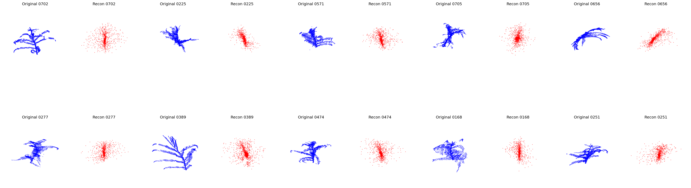
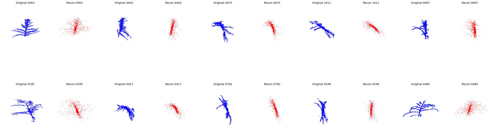

# Project 
Temporal-Based Training Pipeline for PointNet++ Autoencoder

## Project Overview: 
Project Name:
PointNet++ Autoencoder Training Pipeline with Temporal Orchestration

Objective:
To build a fault-tolerant, resumable ML training pipeline using Temporal workflows for training a PointNet++ Autoencoder on 3D point cloud data.


## Dataset Download:
MaizeField3D: A Curated 3D Point Cloud Dataset of Field-Grown Plants From A Maize Diversity Panel 
[Dataset Download:](https://huggingface.co/datasets/BGLab/MaizeField3D)

```
Execution Flow:

run_workflow.py
      ↓
MLPipelineWorkflow
      ↓
1. preprocess_activity
      ↓
2. train_activity (25+ hours, resumable)
      ↓
3. evaluate_activity
      ↓
Return trained model path
```

## Folder Structure:
```
Folder Structure: 

pointnet_temporal/
│
├── worker.py                         # Starts Temporal worker (registers workflows + activities)
├── run_workflow.py                   # Client entry point to start ML pipeline workflow
├── shared.py                         # Shared dataclasses (DatasetConfig, TrainConfig, EvalConfig)
├── configs/
│   ├── dataset_config.py
│   ├── train_config.py
│   └── eval_config.py
│
│
├── requirements.txt
│
├── data/
│   └── FieldGrow_ZeaMays_RawPCD_10k/  # Raw dataset (1045 .ply files)
│       ├── 0001.ply
│       ├── 0002.ply
│       └── ...
│
├── workflow/
│   ├── __init__.py
│   └── ml_pipeline_workflow.py       # Orchestrates:
│                                      #   1. Preprocess
│                                      #   2. Train
│                                      #   3. Evaluate
│                                      #   + Failure handling & retries
│
├── activities/
│   ├── __init__.py
│   ├── preprocess_activity.py        # Converts .ply → processed .npz
│   ├── train_activity.py             # Model training logic
│   └── evaluate_activity.py          # Model evaluation/inference
│
├── models/
│   ├── __init__.py
│   └── pointnet2.py                  # PointNet++ architecture implementation
│
├── utils/
│   ├── preprocessing.py              # FPS, normalization, 2048 downsampling
│   ├── dataset.py                    # Dataset class + train/val split + DataLoader
│   ├── trainer.py                    # Training loop + checkpoint logic
│   ├── metrics.py                    # Chamfer Loss / evaluation metrics
│   ├── visualization.py              # Plots & comparison charts
│   └── checkpoint.py                 # Resume utilities (optional but recommended)
│
├── assets
│    ├── test_comparision.png         # Reconstruction of Test dataset
│    └── validation_comparision.png   # Reconstruction of Val dataset
│
├── outputs/                          # Created automatically
│   ├── processed/                    # Preprocessed .npz dataset
│   ├── checkpoints/                  # Model checkpoints
│   ├── logs/                         # Training logs
│   └── evaluation/                   # Inference outputs
│
└── README.md

```


## Pipeline Steps

### 1. Preprocessing
- Loads .ply files (10K points)
- Applies Farthest Point Sampling → 2048 points
- Normalizes to unit sphere
- Saves as .npz
- Resume-safe: skips processed files

### 2. Training
- Loads preprocessed data
- 80/20 train/validation split
- PointNet++ autoencoder with MSG (Multi-Scale Grouping)
- Chamfer distance loss
- Saves checkpoints every 10 epochs
- Resume-safe: continues from last checkpoint
- Final model saved after training

## Model Architecture

**Encoder**: 3 Set Abstraction layers with MSG
- SA1: 2048 → 1024 points
- SA2: 1024 → 256 points  
- SA3: 256 → 64 points
- Global max pooling → latent vector (128-dim)

**Decoder**: MLP
- 128-dim latent → 2048x3 point cloud

## Checkpointing

Checkpoints saved to `outputs/checkpoints/`:
- `checkpoint_latest.pt` - Latest checkpoint (every 10 epochs)
- `checkpoint_epoch_N.pt` - Snapshot every 50 epochs
- `pointnetpp_ae_final.pt` - Final trained model

Resume training automatically by restarting the workflow.

### 3. Evaluation (Optional)
- **Metrics**: Chamfer distance (mean, median, std, min, max, 95th percentile)
- **Visualizations**:
  - Side-by-side comparison (original vs reconstructed)
  - Chamfer distance distribution (histogram + boxplot)
  - Training/validation loss curves
  - Latent space analysis (PCA + t-SNE)
- **Exports**: Reconstructed point clouds as .ply files
- **Splits**: Evaluates both validation and test sets

## Results: 
Test and validation data Reconstruction: 




## References: 
```
@misc{qi2017pointnetdeephierarchicalfeature,
      title={PointNet++: Deep Hierarchical Feature Learning on Point Sets in a Metric Space}, 
      author={Charles R. Qi and Li Yi and Hao Su and Leonidas J. Guibas},
      year={2017},
      eprint={1706.02413},
      archivePrefix={arXiv},
      primaryClass={cs.CV},
      url={https://arxiv.org/abs/1706.02413}, 
}
```

```
@misc{kimara2025maizefield3dcurated3dpoint,
      title={MaizeField3D: A Curated 3D Point Cloud and Procedural Model Dataset of Field-Grown Maize from a Diversity Panel}, 
      author={Elvis Kimara and Mozhgan Hadadi and Jackson Godbersen and Aditya Balu and Talukder Jubery and Yawei Li and Adarsh Krishnamurthy and Patrick S. Schnable and Baskar Ganapathysubramanian},
      year={2025},
      eprint={2503.07813},
      archivePrefix={arXiv},
      primaryClass={cs.CV},
      url={https://arxiv.org/abs/2503.07813}, 
}
```